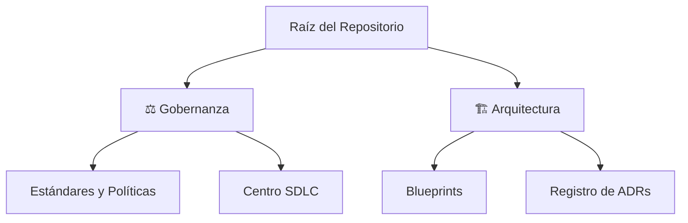

# 🗺️ Índice Maestro Global

> 🌍 **Navegación Bilingüe:** [🇺🇸 English](./MASTER_INDEX.md)

Bienvenido al índice central de **arc32**. Utiliza las rutas a continuación según tu rol para acceder a la documentación relevante.

---

## 🚀 1. Rutas por Rol

| Perfil | Acción | Ruta de Aprendizaje |
| :--- | :--- | :--- |
| **🏢 Proveedor / Partner** | Alineación Técnica | [Onboarding](./governance/standards-es/onboarding/product-quick-start.md) → [Blueprints](./architecture/blueprints-es/reference-blueprint.md) |
| **💻 Ingeniero (Dev/QA)** | Construcción | [SDLC Framework](./governance/sdlc-es/README.md) → [Manifiesto de Ingeniería](./governance/standards-es/engineering/engineering-manifesto.md) |
| **🏗️ Arquitecto** | Centro de Decisión | [ADR Hub](./architecture/adrs-es/README.md) → [Roadmap](./governance/standards-es/vision/evolutionary-strategy-roadmap.md) |
| **📈 Product Manager** | Roadmap | [Visión](./governance/standards-es/vision/architectural-directives.md) → [Checklist DoD](./governance/sdlc-es/02-engineering/construction-focused-sdlc-framework.md) |

---

## 🛡️ 2. Cumplimiento Mandatorio (Línea Base)

Todo artefacto en este repositorio debe respetar estos pilares:

1.  📄 **[Agnosticismo de Stack](./architecture/blueprints-es/authoritative-tech-stack-agnostic.md)**: Reglas universales de desacoplamiento.
2.  📄 **[Arquitectura de Referencia](./architecture/blueprints-es/reference-blueprint.md)**: Patrones Hexagonales y DDD.
3.  📄 **[Definición de Hecho (DoD)](./governance/sdlc-es/02-engineering/construction-focused-sdlc-framework.md)**: Puerta de calidad para producción.

---

## 🏢 3. Mapa del Ecosistema

---

  <a href="./README.es.md">← Volver al Portal</a>

