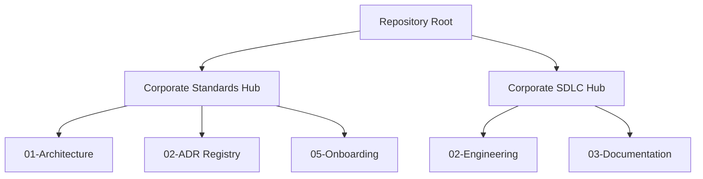

# 🗺️ Global Master Index (Enterprise Entry Point)

> 🌍 **Bilingual Navigation:** [🇪🇸 Versión en Español (Índice Maestro)](./MASTER_INDEX.es.md)

Welcome to the **arc32** central nervous system. This master index serves as the canonical routing gate for all actors interacting with this repository. Locate your designated profile below to access the accelerated read-path ensuring technical and procedural compliance.

---

## 🚀 1. Accelerated Paths by Role (Role-Based Navigation)

Identify your current relationship with the project to unlock the tailored compulsory reading hierarchy.

| Enterprise Role | Recommended Reading Path | Compliance Expected |
| :--- | :--- | :--- |
| **External Software Vendor** | 1. [Product Quick Start](./00-governance/standards/05-onboarding/product-quick-start.md) 2. [Agnostic Tech Baseline](./01-architecture/blueprints/authoritative-tech-stack-agnostic.md) + [Runtime Addendum](./01-architecture/blueprints/authoritative-tech-stack.md) 3. [Reference Blueprint (Deep Dive)](./01-architecture/blueprints/reference-blueprint.md) | Validate local stack matching and boundary isolation before initiating work order. |
| **Backend Developer / QA** | 1. [Agnostic Tech Baseline](./01-architecture/blueprints/authoritative-tech-stack-agnostic.md) + [Runtime Addendum](./01-architecture/blueprints/authoritative-tech-stack.md) 2. [Construction-Focused SDLC Framework](./00-governance/sdlc/02-engineering/construction-focused-sdlc-framework.md) 3. [Best Practices for SDLC Docs](./00-governance/sdlc/03-documentation/sdlc-documentation-best-practices.md) | Guarantee Unit Test thresholds, DoD alignment, and zero logic-leaks in PRs. |
| **Solutions Architect** | 1. [Reference Blueprint](./01-architecture/blueprints/reference-blueprint.md) 2. [Evolutionary Strategy Roadmap](./00-governance/standards/00-vision/evolutionary-strategy-roadmap.md) 3. [Architecture Decision Records (ADR Hub)](./01-architecture/adrs/README.md) | Uphold pattern integrity and assess alignment of new extraction triggers. |
| **Team Lead / Product Manager** | 1. [Evolutionary Strategy Roadmap](./00-governance/standards/00-vision/evolutionary-strategy-roadmap.md) 2. [Corporate SDLC Governance Hub](./00-governance/sdlc/README.md) 3. [Product Quick Start](./00-governance/standards/05-onboarding/product-quick-start.md) | Synchronize delivery milestones with architecture phase transitions. |

---

## 🛡️ 2. Mandatory Compliance Path (Global Baseline)

All ecosystem participants—regardless of role seniority—MUST adhere to and enforce the foundational pillars hosted below. Failure to respect these anchors nullifies artifact acceptance into the codebase.

*   📄 **[Universal Agnostic Baseline](./01-architecture/blueprints/authoritative-tech-stack-agnostic.md)**: Universal systems constraints for all runtimes.
*   📄 **[Target Runtime Appendices](./01-architecture/blueprints/authoritative-tech-stack.md)**: Framework mappings for Node.js, .NET, and Android.
*   📄 **[Reference Architectural Blueprint](./01-architecture/blueprints/reference-blueprint.md)**: Conceptual grounding for Hexagonal boundaries and Ports/Adapters logic.
*   📄 **[SDLC Governance Definition of Done](./00-governance/sdlc/02-engineering/construction-focused-sdlc-framework.md#✅-4-engineering-definition-of-done-dod-checklist)**: Final quality gate blocking production integration.
*   📄 **[Phase 1 Simplicity Checklist](./01-architecture/blueprints/simplicity-checklist-phase-01.md)**: Normative safeguard against premature over-engineering.

---

## 🏢 3. Enterprise Hub Structural Map

Below represents the physical grouping layout of high-level governance modules within this corporate workspace.

*   👉 **[English Documentation Center Root](./00-governance/standards/README.md)**
*   👉 **[English SDLC Governance Center Root](./00-governance/sdlc/README.md)**
*   👉 **[Central Navigation Map (Back to Main README)](./README.md#⚡-4-central-navigation-quick-map-english-context)**
