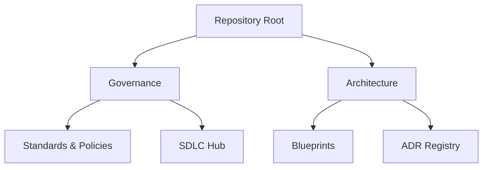

# 🗺️ Global Master Index

> 🌍 **Bilingual Navigation:** [🇪🇸 Español](./MASTER_INDEX.es.md)

Welcome to the **arc32** central index. Use the paths below based on your role to access the relevant documentation.

---

## 🚀 1. Role-Based Navigation

| Role | Action | Reading Path |
| :--- | :--- | :--- |
| **🏢 Vendor / Partner** | Tech Alignment | [Onboarding](./governance/standards/onboarding/product-quick-start.md) → [Blueprints](./architecture/blueprints/reference-blueprint.md) |
| **💻 Engineer (Dev/QA)** | Construction | [SDLC Framework](./governance/sdlc/README.md) → [Engineering Manifesto](./governance/standards/engineering/engineering-manifesto.md) |
| **🏗️ Architect** | Decision Hub | [ADR Hub](./architecture/adrs/README.md) → [Roadmap](./governance/standards/vision/evolutionary-strategy-roadmap.md) |
| **📈 Product Manager** | Roadmap | [Vision](./governance/standards/vision/architectural-directives.md) → [DoD Checklist](./governance/sdlc/02-engineering/construction-focused-sdlc-framework.md) |

---

## 🛡️ 2. Mandatory Compliance (Baseline)

Every artifact in this repository must respect these pillars:

1.  📄 **[Agnostic Baseline](./architecture/blueprints/authoritative-tech-stack-agnostic.md)**: Universal decoupling rules.
2.  📄 **[Reference Architecture](./architecture/blueprints/reference-blueprint.md)**: Hexagonal & DDD patterns.
3.  📄 **[Definition of Done](./governance/sdlc/02-engineering/construction-focused-sdlc-framework.md)**: Quality gate for production.

---

## 🏢 3. Ecosystem Map

---

  <a href="./README.md">← Back to Portal</a>

