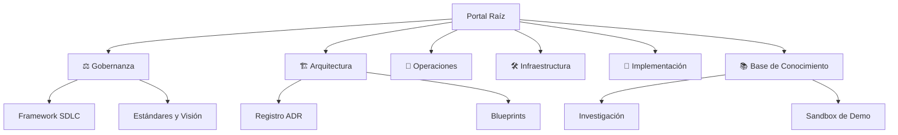

<div align="center">
  # 🌐 arc32: Arquitectura Progresiva Enterprise
  
  []()
  []()
  []()

  ### *El plano definitivo para sistemas empresariales resilientes, escalables y aumentados por IA.*

  [🇺🇸 English](./README.md) | [🇪🇸 Español](./README.es.md)
</div>

---

## 🧭 Portal Maestro de Navegación
Bienvenido al corazón del ecosistema **arc32**. Este repositorio no es solo código; es un **sistema de documentación vivo** diseñado para el descubrimiento fluido y una integración rápida.

### 🏛️ Taxonomía del Repositorio
Nuestra documentación sigue una estructura estricta de **Monorepo Centrado en la Fuente**, separando la Gobernanza de la Implementación.



---

# 📖 Hub de Navegación por Perfil
**No explores los directorios al azar.** Selecciona tu perfil para acceder a tu ruta de lectura obligatoria.

| Perfil | Objetivo | Paso 1: Base | Paso 2: Contexto | Paso 3: Acción |
| :--- | :--- | :--- | :--- | :--- |
| **💼 Ejecutivo** | Visión y ROI | [Visión del Producto](./governance/standards-es/vision/architectural-directives.md) | [Roadmap Evolutivo](./governance/standards-es/vision/evolutionary-strategy-roadmap.md) | [Estrategia](./governance/standards-es/vision/evolutionary-strategy-roadmap.md) |
| **📈 Product Owner** | Planificación | [Sandbox PRD](./knowledge/demo/project/01-prd-demo-sandbox-es.md) | [Glosario de Negocio](./knowledge/demo/functional/business-glossary.md) | [Backlog de Proyecto](./knowledge/demo/project/02-backlog-and-epics-es.md) |
| **🎖️ Team Lead** | Cumplimiento | [Framework SDLC](./governance/sdlc-es/README.md) | [Manifiesto de Ing.](./governance/standards-es/engineering/engineering-manifesto.md) | [Guía de Onboarding](./governance/standards-es/onboarding/product-quick-start.md) |
| **🏗️ Arquitecto** | Decisiones | [Blueprint de Ref.](./architecture/blueprints-es/reference-blueprint.md) | [Resumen Tech Stack](./architecture/blueprints-es/tech-stack-summary.md) | [Registro de ADRs](./architecture/adrs-es/README.md) |
| **⚙️ Backend Dev** | Construcción | [Taxonomía Repo](./architecture/blueprints-es/tech-stack-summary.md) | [ADR Arq. Limpia](./architecture/adrs-es/nodejs/0002-clean-architecture-nestjs.md) | [Verificación Sandbox](./knowledge/demo/technical/sandbox-verification.md) |
| **🎨 Frontend Dev** | UX e Integración | [Sistema de Diseño](./architecture/blueprints-es/tech-stack-summary.md) | [ADR Evolución BFF](./architecture/adrs-es/nodejs/0008-progressive-multimodule-evolution-gateway-bff.md) | [Resiliencia Offline](./architecture/adrs-es/nodejs/0004-frontend-offline-resilience.md) |
| **🚀 DevOps/SRE** | Infra y Ops | [Mapa de Infra](./infrastructure/README.md) | [SDLC / CI-CD](./governance/sdlc-es/README.md) | [Runbook de Ops](./operations/README.es.md) |
| **🧪 QA/SDET** | Calidad | [ADR Pirámide Test](./architecture/adrs-es/core/0018-testing-pyramid-quality-gates.md) | [Estándares Calidad](./governance/standards-es/engineering/contract-testing-guideline.md) | [Docs Automatización](./governance/standards-es/engineering/contract-testing-guideline.md) |
| **🛡️ Seguridad** | Cumplimiento | [Estándares Seg.](./governance/standards-es/engineering/vendor-risk-assessment.md) | [ADR Estrategia RLS](./architecture/adrs-es/core/0010-multi-tenancy-architecture-strategy.md) | [ADR Auditoría](./architecture/adrs-es/core/0016-immutable-business-audit-trail.md) |
| **🤖 AI Contributor** | Flujo Agéntico | [Reglas Harness](./.harness/rules/global-rules.md) | [ADR Patrones IA](./governance/standards-es/ai-augmented/06-adrs/README.md) | [Madurez AI](./governance/standards-es/ai-augmented/07-maturity-model/README.es.md) |
| **🆕 New Joiner** | Onboarding | [Inicio Rápido](#-inicio-rápido) | [Guía Onboarding](./governance/standards-es/onboarding/product-quick-start.md) | [Entorno Dev](./governance/standards-es/onboarding/product-quick-start.md) |

---

## ⚡ Hub Maestro de Acceso Rápido
Acceso directo a los módulos centrales de documentación.

| Módulo | Enlace | Descripción |
| :--- | :--- | :--- |
| **🏗️ Arquitectura** | [Registro ADR](./architecture/adrs-es/README.md) | Decisiones, Blueprints y Mapas Técnicos. |
| **📋 Funcional** | [Centro de Proyecto](./knowledge/demo/project/README.es.md) | Backlog, Historias y Specs de Producto. |
| **⚖️ Gobernanza** | [Estándares](./governance/standards-es/README.md) | Reglas y Estándares de Ingeniería y Seguridad. |
| **🚀 Operaciones** | [Runbook](./operations/README.es.md) | Mantenimiento, Monitoreo e Incidentes. |
| **🛠️ Infraestructura** | [Terraform/Docker](./infrastructure/README.md) | Orquestación y Entorno Local. |
| **📚 Conocimiento** | [Índice Maestro](./MASTER_INDEX.es.md) | Directorio completo de todos los activos. |

---

## 🚀 Inicio Rápido (Sandbox)
Experimenta la arquitectura en acción en menos de 5 minutos.

```bash
# 1. Clonar e Instalar
git clone https://github.com/beyondnetcode/arc32_progresive_monolith.git
cd src/ && npm install

# 2. Levantar Infraestructura
docker-compose -f ../infrastructure/docker-compose.yaml up -d

# 3. Iniciar Desarrollo
npm run dev
```

---

## 🤝 Contribución y Calidad
- **BMAD-METHOD**: Utilizamos una metodología de IA dirigida por especificaciones para toda la documentación.
- **Gitflow**: Estrategia de ramas estrictamente aplicada (ver [ADR-0050](./architecture/adrs-es/core/0050-estrategia-ramas-gitflow.md)).
- **Linting**: Toda la documentación y el código deben pasar puertas de calidad automatizadas.

---

<div align="center">
  <sub>© 2026 Ecosistema arc32 | Habilitado por BMAD-METHOD | Ingeniería de IA Aumentada</sub>
</div>