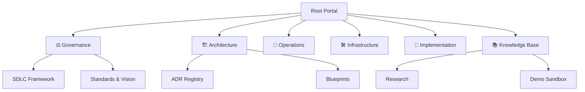

<div align="center">
  # 🌐 arc32: Enterprise Progressive Architecture
  
  []()
  []()
  []()

  ### *The definitive blueprint for resilient, scaling, and AI-augmented enterprise systems.*

  [🇺🇸 English](./README.md) | [🇪🇸 Español](./README.es.md)
</div>

---

## 🧭 Master Navigation Portal
Welcome to the heart of the **arc32** ecosystem. This repository is not just code; it's a **living documentation system** designed for seamless discovery and rapid onboarding.

### 🏛️ Repository Taxonomy
Our documentation follows a strict **Source-Centric Monorepo** structure, separating Governance from Implementation.



---

# 📖 Role-Based Navigation Hub
**Do not explore directories at random.** Select your profile to access your mandatory reading path.

| Profile | Objective | Step 1: Foundation | Step 2: Context | Step 3: Action |
| :--- | :--- | :--- | :--- | :--- |
| **💼 Executive** | Vision & ROI | [Product Vision](./governance/standards/vision/architectural-directives.md) | [Evolutionary Roadmap](./governance/standards/vision/evolutionary-strategy-roadmap.md) | [Strategy](./governance/standards/vision/evolutionary-strategy-roadmap.md) |
| **📈 Product Owner** | Req & Planning | [PRD Sandbox](./knowledge/demo/project/01-prd-demo-sandbox.md) | [Business Glossary](./knowledge/demo/functional/business-glossary.md) | [Project Backlog](./knowledge/demo/project/02-backlog-and-epics.md) |
| **🎖️ Team Lead** | Compliance | [SDLC Framework](./governance/sdlc/README.md) | [Engineering Manifesto](./governance/standards/engineering/engineering-manifesto.md) | [Onboarding Guide](./governance/standards/onboarding/product-quick-start.md) |
| **🏗️ Architect** | Decisions | [Reference Blueprint](./architecture/blueprints/reference-blueprint.md) | [Tech Stack Summary](./architecture/blueprints/tech-stack-summary.md) | [ADR Registry](./architecture/adrs/README.md) |
| **⚙️ Backend Dev** | Construction | [Repo Taxonomy](./architecture/blueprints/tech-stack-summary.md) | [Clean Arch ADR](./architecture/adrs/nodejs/0002-clean-architecture-nestjs.md) | [Sandbox Verification](./knowledge/demo/technical/sandbox-verification.md) |
| **🎨 Frontend Dev** | UX & Integration | [Design System](./architecture/blueprints/tech-stack-summary.md) | [BFF Evolution ADR](./architecture/adrs/nodejs/0008-progressive-multimodule-evolution-gateway-bff.md) | [Offline Resilience](./architecture/adrs/nodejs/0004-frontend-offline-resilience.md) |
| **🚀 DevOps/SRE** | Infra & Ops | [Infrastructure Map](./infrastructure/README.md) | [SDLC / CI-CD](./governance/sdlc/README.md) | [Operations Runbook](./operations/README.md) |
| **🧪 QA/SDET** | Quality | [Testing Pyramid ADR](./architecture/adrs/core/0018-testing-pyramid-quality-gates.md) | [Quality Standards](./governance/standards/engineering/contract-testing-guideline.md) | [Automation Docs](./governance/standards/engineering/contract-testing-guideline.md) |
| **🛡️ Security** | Compliance | [Security Standards](./governance/standards/engineering/vendor-risk-assessment.md) | [RLS Strategy ADR](./architecture/adrs/core/0010-multi-tenancy-architecture-strategy.md) | [Audit Trail ADR](./architecture/adrs/core/0016-immutable-business-audit-trail.md) |
| **🤖 AI Contributor** | Agentic Flow | [Harness Rules](./.harness/rules/global-rules.md) | [Agentic Patterns ADR](./governance/standards/ai-augmented/06-adrs/README.md) | [AI Maturity Model](./governance/standards/ai-augmented/07-maturity-model/README.md) |
| **🆕 New Joiner** | Onboarding | [Quick Start](#-quick-start) | [Onboarding Guide](./governance/standards/onboarding/product-quick-start.md) | [Dev Environment](./governance/standards/onboarding/product-quick-start.md) |

---

## ⚡ Master Quick Access Hub
Direct access to the core documentation modules.

| Module | Link | Description |
| :--- | :--- | :--- |
| **🏗️ Architecture** | [ADR Registry](./architecture/adrs/README.md) | Decisions, Blueprints, and Technical Maps. |
| **📋 Functional** | [Project Hub](./knowledge/demo/project/README.md) | Backlog, Stories, and Product Specs. |
| **⚖️ Governance** | [Standards](./governance/standards/README.md) | Rules, Engineering, and Security standards. |
| **🚀 Operations** | [Runbook](./operations/README.md) | Maintenance, Monitoring, and Incidents. |
| **🛠️ Infrastructure** | [Terraform/Docker](./infrastructure/README.md) | Orchestration and Local Env. |
| **📚 Knowledge** | [Master Index](./MASTER_INDEX.md) | Full directory of all assets. |

---

## 🚀 Quick Start (Sandbox)
Experience the architecture in action in less than 5 minutes.

```bash
# 1. Clone & Install
git clone https://github.com/beyondnetcode/arc32_progresive_monolith.git
cd src/ && npm install

# 2. Spin up Infrastructure
docker-compose -f ../infrastructure/docker-compose.yaml up -d

# 3. Start Development
npm run dev
```

---

## 🤝 Contribution & Quality
- **BMAD-METHOD**: We use a spec-driven AI methodology for all documentation.
- **Gitflow**: Strictly enforced branching strategy (see [ADR-0050](./architecture/adrs/core/0050-gitflow-branching-strategy.md)).
- **Linting**: All markdown and code must pass automated quality gates.

---

<div align="center">
  <sub>© 2026 arc32 Ecosystem | Enabled by BMAD-METHOD | Augmented AI Engineering</sub>
</div>