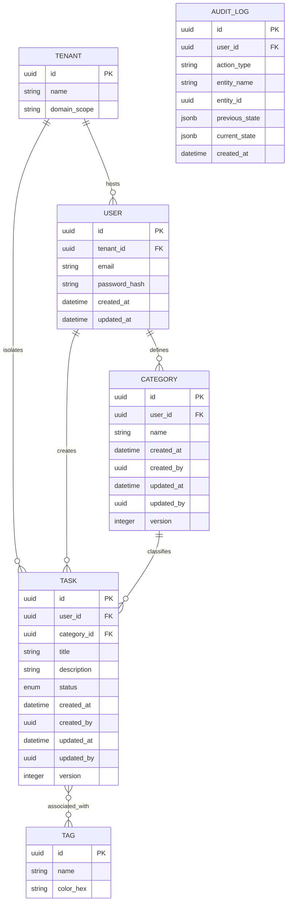

# 🗃️ Conceptual Data Model

The core domain model utilizes a **Hybrid Audit Strategy** (ADR-0014). Every transactional table inherits standard auditing columns, and an external immutable ledger tracks the historical delta changes.

## 1. Entity Relationship Diagram (Mermaid)

---

## 2. Common Audit Columns (BaseEntity)
To ensure the model aligns with corporate compliance strategies, `CATEGORY` and `TASK` entities MUST implement the following system metadata:

| Column Name | Type | Purpose |
| :--- | :--- | :--- |
| `created_at` | `TIMESTAMP` | Instant of the first write transaction. |
| `created_by` | `UUID` | Originating user who committed the record. |
| `updated_at` | `TIMESTAMP` | Instant of the most recent modification. |
| `updated_by` | `UUID` | Actor responsible for the modification. |
| `version` | `INT` | Incremental sequence token to prevent race conditions. |

## 3. Field Definitions

### User Table
*   `email`: Primary login identity. Unique constraint.

### Task Table
*   `user_id`: Scoped owner (FK) for basic application authorization.
*   `category_id`: Classifying bucket. Can be NULL.

### Audit Log Table
*   **Immutability Rule**: This table allows only `INSERT` operations.
*   `action_type`: Enumeration (CREATE, UPDATE, DELETE).
*   `previous_state` / `current_state`: JSON serialization used to perform visual Diff analysis for auditors.
