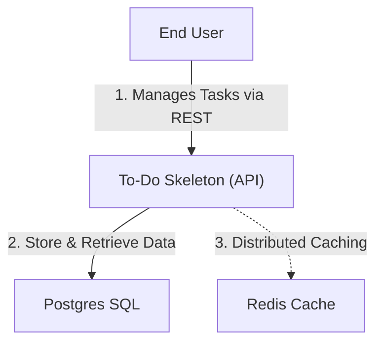
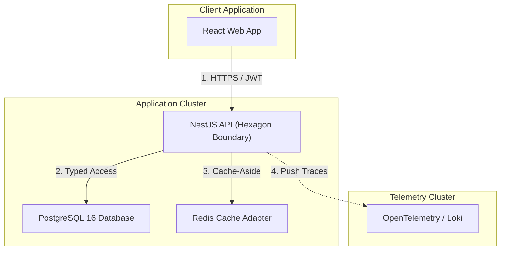
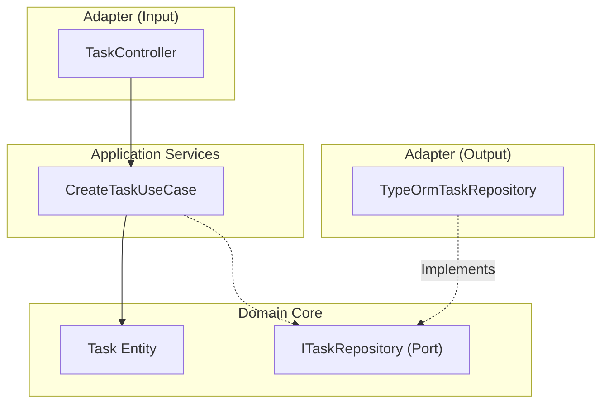

# 🏛️ Software Architecture Design Document (To-Do Reference)

This document details the formal system design specification for the **`arc-nodejs-workspace`** monorepo. It adopts the **C4 Model** standard and presents the audited technical inventory demonstrating Hexagonal Architecture.

---

## 🎯 1. Architectural Scope
The baseline requirement for this project is delivering a repeatable **Technical Template** optimized for NodeJS best practices, Clean Architecture, and high-coverage observability.

---

## 🗺️ 2. C4 Model

### Level 1: System Context Diagram
Defines the boundary of the Reference Application with its immediate consumers.

### Level 2: Container Diagram
Maps the physical components making up the solution.

### Level 3: API Component Diagram (Clean Architecture Zoom)
Demonstrates strict dependency direction targeting the Domain Core.

---

## 📊 3. Technical Inventory (Core Baseline)

| Layer | Tool | Version | Purpose |
| :--- | :--- | :--- | :--- |
| **Framework** | `@nestjs/core` | `^10.0.0` | IoC Container, API Routing. |
| **ORM** | `typeorm` | `^0.3.28` | Mapping entities to Postgres tables. |
| **Monorepo** | `nx` | `^20.3.0` | Speed-caching builds & tasks. |
| **Security** | `helmet` / `bcrypt` | Latest | Standard headers and secure storage. |

---

## 🧠 4. Architectural Decision Matrix
Maps architectural decisions to system quality attributes. Reference the ADR index for details.

| Decision | ADR | Quality Attribute |
| :--- | :--- | :--- |
| **Hexagonal Boundaries** | [ADR 0002](../03-adrs/0002-clean-architecture-nestjs.md) | Testability, Modularism |
| **Observability** | [ADR 0007](../03-adrs/0007-observability-telemetry-loki-opentelemetry.md) | Maintainability, Supportability |
| **Fault Tolerance** | [ADR 0010](../03-adrs/0010-fault-tolerance-resiliency-patterns.md) | Reliability |
| **Distributed Cache** | [ADR 0012](../03-adrs/0012-distributed-caching-strategy-redis.md) | Performance |
| **Tactical Integrity** | [ADR 0016](../03-adrs/0016-tactical-design-patterns-future-proofing.md) | Pure Code Maintainability |

---

## 🛡️ 5. Operational Evaluation
This template is validated for linear scalability and minimal infrastructure lock-in, fully enabling standalone deployments via standard Docker orchestration without premium SaaS external dependency requirements.
