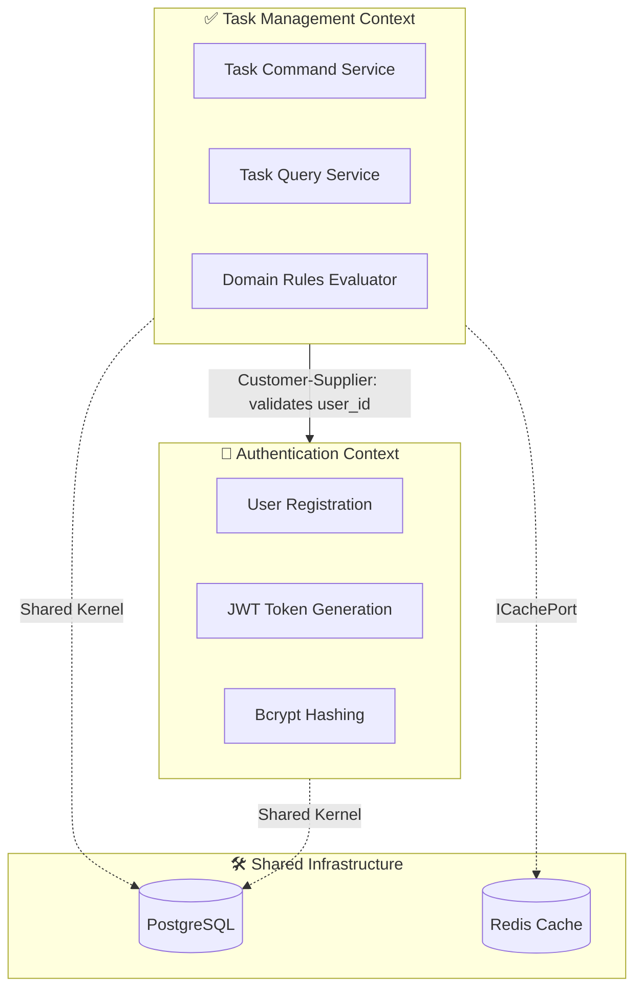

# 🗺️ Bounded Context Map — To-Do Reference Skeleton

This document establishes the formal **Domain-Driven Design (DDD) Bounded Context Map** for the Reference Template, defining the isolated execution boundaries.

## 📐 1. Context Map Overview

---

## 📦 2. Context Definitions

### 🔐 A. Authentication Context
**Mission:** Own the identity management primitives and session token issuing.

**Owns:**
- `User` aggregate.
- `IPasswordHasher` port.
- Auth Controller (Login/Register).

---

### ✅ B. Task Management Context
**Mission:** Coordinate all operations related to atomic workflow tasks.

**Owns:**
- `Task` aggregate.
- `ITaskRepository` port.
- Use Cases: `CreateTask`, `ListTasks`, `CompleteTask`.

**Integration Contract:** 
Relies upstream on AuthContext to supply valid, authenticated user context for all transaction scoping.

---

## 🚧 3. Anti-Corruption Layers (ACL)

| Boundary | ACL Mechanism | Reason |
| :--- | :--- | :--- |
| Task Domain ↔ Redis | `ICachePort` | Prevents direct Redis driver leaks into domain layer. |
| Task Domain ↔ TypeORM | `ITaskRepository` | Ensures infrastructure ORM decorators don't impact core TS entity rules. |
| Auth Domain ↔ Bcrypt | `IPasswordHasher` | Decouples crypto algorithm choices from application workflow. |
