# [ADR 0030](0030-api-gateway-kong-vs-nestjs.md): Estrategia de Gateway de API - Kong Edge vs NestJS BFF

## Estado
Aprobado

## Fecha
2026-05-10

## Contexto
Utilizar hilos de la aplicación Node.js para realizar enrutamiento de infraestructura a nivel de red puro, limitación de tasa de volumen masivo o terminación SSL genérica desperdicia bucles de eventos de un solo hilo en sobrecarga, degradando la velocidad crítica de la aplicación. Por el contrario, empujar fusiones complejas de cargas útiles de API o agregados recursivos de bases de datos en scripts Lua de proxy sin procesar crea un atasco operativo.

## Decisión
Formalizar un rígido **Modelo de Gateway Distribuido de Dos Capas** para desacoplar correctamente la infraestructura de la orquestación:

1. **Capa 1 - Edge Gateway (Kong OSS)**: Barrera de alto rendimiento basada en NGINX. Se sitúa literalmente en el perímetro del clúster público. Gestiona solo reglas transversales no funcionales: SSL, estrangulamiento de claves de API, validación de firma de origen JWT simple, reenvío de ruta y reglas WAF.
2. **Capa 2 - Gateway de Aplicación (NestJS BFF)**: Lógica de Node personalizada desplegada de forma segura dentro de la zona de seguridad de Capa 1. Responsable de componer respuestas de datos heterogéneos, eliminar PII para formatos de UI genéricos, adaptar las cargas útiles del dispositivo y gestionar la mecánica de cookies del usuario.

### Arquitectura Actualizada de Dos Capas

```mermaid
graph TD
    U["Clientes Públicos (Mobile / Web)"] -->|TLS/HTTP| K["[Capa 1] Kong Edge Gateway"]
    
    subgraph SecureCluster["Red Protegida"]
        K -->|Reenvío| W["[Capa 2] NestJS Web BFF"]
        K -->|Reenvío| M["[Capa 2] NestJS Mobile BFF"]
        
        W --> API["Núcleo Plataforma Referencia"]
        W --> TMS["Transport Service"]
        M --> API
    end
```

## Consecuencias

### Positivas
- Separa las preocupaciones binarias en bruto de la agregación lógica. Node no desperdicia ciclos bloqueando DDOS/Spams.
- Capacidad de escala de rendimiento extremo. El núcleo de NGINX devora cómodamente volúmenes de tráfico que Node solo no puede.
- Mejora el aislamiento del backend (la Capa 1 protege explícitamente a la Capa 2).

### Negativas
- Añade una variable de latencia de segundo salto (típicamente insignificante <1ms de sobrecarga si se despliega correctamente).
- Introduce el ciclo de vida del stack operativo de gestión de Kong.

## Referencias
- [ADR-0008: Patrones Progresivos de BFF](../adrs/nodejs/0008-progressive-multimodule-evolution-gateway-bff.md)
- [ADR-0027: Borde de Protocolo Dual](../adrs/nodejs/0027-dual-protocol-rest-grpc-api-gateway.md)

---
[? Volver al Índice](./README.es.md)
