# [ADR 0008](0008-progressive-multimodule-evolution-gateway-bff.md): Evolución Progresiva Multi-Módulo con API Gateway y Patrones BFF

## Estado
Aprobado

## Fecha
2026-05-08

## Contexto
Actualmente, el repositorio de la Plataforma de Referencia opera como un monolito modular. Sin embargo, la plataforma está destinada a escalar hacia un portal unificado para múltiples módulos corporativos futuros (Gestión de Transporte - TMS, Gestión de Almacén - WMS). Estos deben ser servicios independientes y desacoplados con bases de datos aisladas.

Sin una capa Backend For Frontend (BFF), los clientes diversos (web rica, móvil de bajo ancho de banda, B2B) forzarían endpoints genéricos, conduciendo al over-fetching y a una gestión rígida del estado del cliente. Necesitamos una estructura para soportar diversos contratos de cliente sin acoplarlos estrechamente a los microservicios del backend.

## Decisión
Adoptar una **Arquitectura de Gateway Backend For Frontend (BFF) Distribuida y Multi-Módulo Progresiva**:

1. **Gateways BFF Dedicados**: Adaptar gateways dedicados para cada tipo de cliente en lugar de compartir un único punto de entrada genérico:
   - **Web BFF**: Maneja sesiones basadas en cookies y agrega cargas útiles para visualizaciones de escritorio ricas.
   - **Mobile BFF**: Comprime datos, combina roundtrips para redes de alta latencia y traduce a cargas útiles optimizadas para móviles.
   - **B2B API Gateway**: Maneja la limitación de tasa (rate-limiting) y la autenticación con Clave de API para socios externos.

2. **Aislamiento Aguas Abajo**: Los clientes públicos NUNCA se comunican directamente con los servicios internos (TMS, WMS). Todo el tráfico fluye a través de los BFFs asignados que actúan como fronteras de seguridad y composición.

3. **Traducción de Protocolos**: Permitir la comunicación interna de microservicios vía gRPC de alta velocidad mientras se traduce a HTTP/REST estándar en el borde del BFF.

### Resumen de la Arquitectura del Sistema

```mermaid
graph TD
    Web["Aplicación Web React"] -->|HTTP/Cookies| WebBFF["Web BFF Gateway"]
    Mobile["Aplicación Cliente Móvil"] -->|HTTP/JSON| MobileBFF["Mobile BFF Gateway"]
    B2B["Integraciones B2B Externas"] -->|HTTPS/Clave API| B2BGateway["B2B API Gateway"]

    subgraph InternalNetwork["Zona de Confianza Interna (gRPC)"]
        WebBFF --> CoreAPI["API Plataforma Referencia"]
        WebBFF --> TMS["Servicio TMS"]
        MobileBFF --> CoreAPI
        MobileBFF --> TMS
        B2BGateway --> WMS["Servicio WMS"]
    end
```

## Consecuencias

### Positivas
- **Rendimiento del Cliente**: Las aplicaciones móviles obtienen exactamente lo que necesitan, reduciendo el uso de datos y los recorridos de red (roundtrips).
- **Escalabilidad Independiente**: Escalar el BFF Móvil independientemente del BFF Web basado en el tráfico de dispositivos en tiempo real.
- **Contratos Desacoplados**: Modificar las APIs internas aguas abajo sin romper las versiones de frontend existentes.

### Negativas
- **Proliferación de Gateways**: Gestionar bases de código separadas para diferentes BFFs incrementa la complejidad de CI/CD.
- Requiere disciplina para mantener la lógica de negocio fuera del BFF (solo debería orquestar y componer).

## Referencias
- [ADR-0030: Kong Gateway vs NestJS BFF](../adrs/core/0030-api-gateway-kong-vs-nestjs.md)

---
[? Volver al Índice](./README.es.md)
