# 🏗️ Especificación de Arquitectura y Especificaciones de Modelado C4

Este documento detalla el riguroso diseño arquitectónico de grado empresarial para la plataforma de referencia, conforme al estándar del blueprint **arc42** (ARC32). El diseño implementa un ecosistema **SaaS Multi-Tenant** avanzado utilizando **Gateways BFF** para gestionar la entrega a clientes.

---

## 🗺️ 1. Estructura Estática del Sistema (Modelo C4)

### Nivel 1: Diagrama de Contexto del Sistema
Define nuestro sistema delimitado dentro del ecosistema empresarial, sus consumidores (inquilinos) y actores externos activos.

```mermaid
graph TD
    subgraph Clients["Ecosistema de Clientes Multi-Tenant"]
        WebPortal["Cliente Web\n[Caché Offline React Query]"]
        MobileApp["Aplicaciones Móviles\n[Caché SQLite Nativa]"]
        ThirdParty["Servicios Externos B2B (claves API)"]
    end

    subgraph EdgeNet["Borde de Red"]
        CDN["CDN (Caché Distribuida Global)"]
    end

    subgraph CoreSystem["[El Sistema de Plataforma de Referencia]"]
        MainCore["Núcleo de Monolito Modular"]
        BFFGateway["Gateways de API BFF"]
    end

    subgraph ExternalDependencies["Ecosistema Externo"]
        ExternalIdP["Proveedores de Identidad (Auth0 / Entra ID)"]
        MessageBus["Bus Empresarial (RabbitMQ/Kafka)"]
    end

    WebPortal -->|HTTP/REST| CDN
    MobileApp -->|HTTP/REST| CDN
    ThirdParty -->|gRPC/REST| CDN
    
    CDN -->|Peticiones de Origen| BFFGateway
    BFFGateway -->|Enrutamiento Interno| MainCore
    
    MainCore -->|Validar Confianza| ExternalIdP
    MainCore -->|Emitir Eventos| MessageBus
```

### Nivel 2: Diagrama de Contenedores (Tiempo de Ejecución de Alta Densidad)
Demuestra la segregación física de los puntos de entrada de comunicación (BFFs) hasta la infraestructura de la base de datos multi-tenant.

```mermaid
graph TD
    subgraph ClientLayer["Capa -1: Núcleo del Cliente"]
        WebClient["Interfaz Web\n[React Query / Caché de Cliente]"]
    end

    subgraph PublicEdge["Capa 0: Caché Estática"]
        CDN["CDN / Caché de Navegador (Opcional)"]
    end

    subgraph EntryLayer["Nivel 1: Ingreso y Enrutamiento"]
        KongGateway["Gateway Kong / Gestión de APIs"]
    end

    subgraph BFFLayer["Nivel 2: Backend-for-Frontend (BFF)"]
        WebBFF["BFF Web NestJS (GraphQL / REST)"]
        MobileBFF["BFF Móvil NestJS (GraphQL / REST)"]
    end

    subgraph ApplicationLayer["Nivel 3: Contextos de Negocio Centrales"]
        MainAPI["API Core NestJS (Reglas de Dominio)"]
    end

    subgraph StorageLayer["Nivel 4: Persistencia y Estado"]
        PostgresSQL[("PostgreSQL 16 (RLS de Doble Capa)")]
        RedisCache[("Caché Distribuida Redis")]
    end

    WebClient -->|Petición HTTPS| CDN
    CDN -->|Reenvío Dinámico| KongGateway
    KongGateway -->|HTTP/REST| WebBFF
    KongGateway -->|HTTP/REST| MobileBFF
    
    WebBFF <-->|Lecturas Caché BFF| RedisCache
    WebBFF -->|gRPC Interno| MainAPI
    
    MobileBFF <-->|Lecturas Caché BFF| RedisCache
    MobileBFF -->|gRPC Interno| MainAPI
    
    MainAPI -->|Aislamiento de Inquilinos de Doble Capa| PostgresSQL
    MainAPI <-->|Lecturas Caché Core| RedisCache
```

### Nivel 3: Diagrama de Componentes de API (Arquitectura Hexagonal)
Desglose del acoplamiento interno dentro de la **API Core de NestJS**.

```mermaid
graph TD
    subgraph HTTP["Adaptadores Externos (Ingreso)"]
        Controller["MainController (REST/gRPC)"]
    end

    subgraph Application["Capa de Aplicación"]
        UseCase["BusinessUseCase (Coordinación)"]
        DTO["InputDTO (Validación)"]
    end

    subgraph Core["Capa de Dominio Core"]
        Entity["DomainEntity (Reglas e Invariantes)"]
        IPersistencePort["IPersistencePort (Interfaz)"]
    end

    subgraph Infrastructure["Adaptadores de Persistencia (Egreso)"]
        TypeOrmAdapter["TypeOrmRepository (Implementación)"]
    end

    Controller -->|Ejecuta| UseCase
    UseCase -->|Usa| DTO
    UseCase -->|Muta| Entity
    UseCase -.->|Inyecta Interfaz| IPersistencePort
    TypeOrmAdapter -.->|Implementa| IPersistencePort
```

---

## 📜 2. El Libro de Decisiones Aprobadas (ADRs)

Según lo validado por el Arquitecto Principal, estas decisiones fundacionales están **oficialmente Aprobadas** y son obligatorias para la implementación del sistema.

### 🟢 Grupo A: Fundamentos y Estándares Core
1.  **[ADR 0001: Orquestación de Monorepo](../adrs-es/core/0001-monorepo-orchestration-nx.md)**: Nx y espacios de trabajo npm para un CI/CD lineal y centralizado.
2.  **[ADR 0002: Arquitectura Hexagonal Limpia](../adrs-es/nodejs/0002-clean-architecture-nestjs.md)**: Separación de la lógica core del código del framework.
3.  **[ADR 0003: Estándares Estrictos de TypeScript](../adrs-es/nodejs/0003-strict-typescript-standards.md)**: Tipado absoluto, sin `any`, reglas de ESLint obligatorias.
4.  **[ADR 0005: Seguridad Cero-Costo CodeQL](../adrs-es/core/0005-ci-cd-quality-codeql.md)**: Detección automatizada de vulnerabilidades dentro de la pipeline.
5.  **[ADR 0009: Fijación Estricta de Dependencias](../adrs-es/core/0009-strict-dependency-pinning-vulnerability-management.md)**: Bloqueo de actualizaciones dinámicas para prevenir brechas en la cadena de suministro.

### 🟠 Grupo B: SaaS, Escalabilidad y Distribución
6.  **[ADR 0006: Transición futura a Microservicios vía Dapr](../adrs-es/core/0006-future-microservices-transition-dapr.md)**: Desacoplamiento de activadores para romper monolitos en redes de nodos de malla.
7.  **[ADR 0007: Observabilidad vía OpenTelemetry](../adrs-es/nodejs/0007-observability-telemetry-loki-opentelemetry.md)**: Trazado distribuido a través de BFF, API y BD.
8.  **[ADR 0008: Patrones BFF](../adrs-es/nodejs/0008-progressive-multimodule-evolution-gateway-bff.md)**: Integración multi-canal a través de capas de traducción dedicadas.
9.  **[ADR 0010: Estrategia de Arquitectura Multi-Tenancy SaaS](../adrs-es/core/0010-multi-tenancy-architecture-strategy.md)**: Implementación de Seguridad a Nivel de Fila (RLS) física dentro de PostgreSQL para garantizar el aislamiento.
10. **[ADR 0011: Circuit Breakers de Tolerancia a Fallos](../adrs-es/core/0011-fault-tolerance-resiliency-patterns.md)**: Prevención de degradación en cascada utilizando `opossum`.
11. **[ADR 0013: Topología de Recuperación ante Desastres](../adrs-es/core/0013-cloud-infrastructure-topology-dr.md)**: Diseño de nodos multi-región.
12. **[ADR 0014: Caché Distribuida](../adrs-es/core/0014-distributed-caching-strategy-redis.md)**: Aliviar la base de datos a través de Redis centralizado.
13. **[ADR 0015: Arquitectura Dirigida por Eventos](../adrs-es/core/0015-event-driven-architecture-intra-domain.md)**: Mensajería asíncrona entre contextos delimitados.
14. **[ADR 0016: Auditoría de Negocio Inmutable](../adrs-es/core/0016-immutable-business-audit-trail.md)**: Sistema de registro que graba diffs de estado transaccional completos.

### 🔵 Grupo C: Integración, Identidad y Gobernanza
15. **[ADR 0020: Abstracción de Proveedor de Identidad](../adrs-es/core/0020-identity-provider-abstraction-strategy.md)**: Abstracción de puerto para Okta/Entra ID/Auth0.
16. **[ADR 0021: Gráficos de Auth de Alto Rendimiento](../adrs-es/nodejs/0021-high-performance-auth-and-graph-compilation.md)**: Requisitos de latencia por debajo de 5ms.
17. **[ADR 0026: MFA y Seguridad Adaptativa](../adrs-es/nodejs/0026-mfa-passwordless-adaptive-authentication.md)**: Soporte para WebAuthn y Passkeys.
18. **[ADR 0027: Protocolos Duales REST y gRPC](../adrs-es/nodejs/0027-dual-protocol-rest-grpc-api-gateway.md)**: Streaming interno de alto rendimiento vía gRPC.
19. **[ADR 0030: Kong Gateway vs NestJS Gateway](../adrs-es/core/0030-api-gateway-kong-vs-nestjs.md)**: Separación de proxies de infraestructura de la orquestación de negocio.
20. **[ADR 0029: Primitivas DDD Tácticas](../adrs-es/nodejs/0029-tactical-ddd-primitives-library.md)**: Utilización obligatoria de `@nestjslatam/ddd` estandarizado.
21. **[ADR 0032: Matriz de Decisión de Protocolo de API](../adrs-es/core/0032-api-protocol-decision-matrix-rest-grpc-graphql.md)**: Marco de evaluación que impone REST para exposición pública, gRPC para backbones internos y GraphQL para la agregación optimizada de BFF.

### 🟣 Grupo D: Preparación para la Evolución a Microservicios
22. **[ADR 0031: Esquema por Contexto y Catálogo de Eventos de Dominio](../adrs-es/core/0031-schema-per-context-domain-event-catalog.md)**: Cada contexto delimitado posee un esquema PostgreSQL dedicado (`auth` | `tasks` | `taxonomy` | `audit`). Toda la comunicación entre contextos se rige por un Catálogo formal de Eventos de Dominio con contratos de carga útil tipados, permitiendo la extracción de microservicios sin migración.

---
[? Volver al Índice](./README.es.md)
