# ⚙️ Marco de Trabajo SDLC con Énfasis en la Construcción

> 🌍 **Navegación Bilingüe:** [🇺🇸 English Version](../../sdlc/02-engineering/construction-focused-sdlc-framework.md)

Este estándar normativo consolida la gobernanza que controla la progresión del Ciclo de Vida de Desarrollo de Software (SDLC), estableciendo hitos de salida rigurosos y mecanismos de control especializados para la capa de construcción.

---

## 📖 1. Glosario Central (Terminología Clave)

*   **Hito (Milestone):** Un evento objetivo discreto que marca el final absoluto de una fase del ciclo de vida.
*   **Artefacto:** Un documento físico, diagrama o definición de sistema inmutable resultante de las actividades de la fase.
*   **Definición de Hecho (DoD):** El checklist no negociable que cualquier entregable DEBE satisfacer antes de poder transicionar legalmente a la siguiente fase.
*   **Puerta de Calidad (Gate Review):** Paso de verificación formal que evalúa las métricas de calidad antes de habilitar la progresión del despliegue.

---

## 🗺️ 2. Ciclo de Vida SDLC de Alto Nivel (Matriz Corporativa)

```mermaid
timeline
    title Línea de Tiempo del Ciclo de Vida SDLC
    Fase 1: Concepción : Enmarcado PRD : Alcance Congelado
    Fase 2: Diseño : Blueprint Arquitectónico : Línea Base de Diseño
    Fase 3: Construcción : Composición de Código Fuente : Build Exitoso
    Fase 4: Validación : Regresión QA / UAT : RC Firmado
    Fase 5: Entrega : Despliegue en Entorno : Producción Viva
```

| Nombre de la Fase | Actividades Clave | Artefactos Principales | Hito de Salida |
| :--- | :--- | :--- | :--- |
| **1. Concepción y Descubrimiento** | Validación de mercado, perfilado de Personas, acotación del alcance. | Requisitos del Producto (PRD), Mapa de OKRs. | **Business Sign-Off** (Alcance Congelado). |
| **2. Diseño y Arquitectura** | Selección de patrones, esquemas DB, contratos de API. | Notas de Diseño (F1) / Blueprint (arc42) completo (F2+). | **Línea Base de Diseño**. |
| **3. Construcción** | Codificación, composición de subcomponentes, integración interna. | Código Fuente, Pruebas Automatizadas, Docs de Código. | **Build Exitoso** (Merge de PR Autorizado). |
| **4. Validación y QA** | Verificación de regresiones, pruebas de penetración, flujos de UAT. | Reporte de Pruebas, Aceptación de QA. | **Release Candidate** (RC) Sellado. |
| **5. Entrega y Operaciones** | Despliegue en entorno destino, monitoreo de rendimiento. | Notas de Lanzamiento, Dashboard de Observabilidad. | **Producción Viva** (Monitoreo Nominal). |

---

## 🏗️ 3. Profundización: Gobernanza de la Etapa de Construcción

La etapa de construcción es el latido del corazón de la ingeniería. Para evitar la regresión estructural, exige el cumplimiento de los siguientes sub-ciclos de retroalimentación continua.

### 🔄 3.1 Sub-fases de Construcción (Ciclo Interno)

```mermaid
graph LR
    A[1. Prep Entorno] --> B[2. Código Dominio]
    B --> C[3. Tests Unitarios]
    C --> D[4. Integración]
    D --> E[5. Scan CI]
    E --> F[6. Peer Review]
    F --> G((Definición de Hecho))
    
    style G fill:#28a745,color:#fff
```

1.  **Preparación del Entorno:** Establecimiento de estrategias de ramificación (GitFlow/Trunk), aseguramiento de secretos locales y finalización de servidores Mock de API.
2.  **Composición de Dominio:** Codificación de entidades de negocio puras y aplicación de validaciones estrictas antes de conectar la infraestructura.
3.  **Cosecha de Pruebas Unitarias Automatizadas:** Creación paralela de aserciones de prueba aisladas que garantizan que la lógica central se comporta según lo diseñado.
4.  **Convergencia de Integración:** Fusión de adaptadores de persistencia de infraestructura, vinculación a esquemas de base de datos y ejecución de evaluaciones de subsistemas cableados.
5.  **Disparo de Integración Continua (CI):** Ejecución automatizada al hacer push para validar linting, aplicación de estilos de código y pruebas de sanidad de regresión.
6.  **Revisión de Código por Pares (Peer Review):** Evaluación humana estricta que verifica fugas de seguridad, adopción de antipatrones y adherencia a las directrices arquitectónicas.

### 📊 3.2 Métricas de Umbral de Calidad

La progresión del código impone controles matemáticos para detener ciclos de entrega inestables:

| Métrica | Umbral Mínimo Aceptable | Justificación |
| :--- | :--- | :--- |
| **Cobertura de Código** | $\ge 80\%$ de rutas de lógica de negocio. | Salvaguardar bifurcaciones críticas de decisión. |
| **Complejidad Ciclomática** | $\le 15$ por método/función. | Garantiza que la lógica siga siendo mantenible. |
| **Índice de Vulnerabilidad** | **Cero** alertas CVE Altas/Críticas toleradas. | Cumplimiento estricto del perímetro de seguridad. |
| **Deuda Técnica** | Ratio $< 5\%$ del volumen total del proyecto. | Guardián inmediato de refactorización. |

---

## ✅ 4. Checklist de Definición de Hecho (DoD) de Ingeniería

Una iteración de construcción SOLO se considera legítimamente finalizada cuando todos los marcadores obtienen validación:

*   [ ] **Cobertura Automatizada:** El código ha sido instrumentado con pruebas y pasa la validación de umbral localmente y en CI.
*   [ ] **Análisis Estático:** El código superó el escaneo estático de ESLint/Prettier y SonarQube sin excepciones críticas de "code smell".
*   [ ] **Firma de Revisión:** Se recibió un mínimo de una (1) aprobación de un Lead o desarrollador Par designado.
*   [ ] **Documentación Interna:** Las funciones explícitas incluyen anotaciones en línea, y el ADR o guía externa correspondiente ha sido actualizado.
*   [ ] **Nativo en Observabilidad:** Los nuevos manejadores incluyen contadores de telemetría básicos y salidas de logs estructurados.
*   [ ] **Build Limpio:** El contenedor binario compila con éxito sin advertencias de entorno intermitentes.

---
[? Volver al Índice](./README.es.md)
