# Referencia del Harness: La Armadura del Agente

## Definición Formal de Harness
En esta arquitectura corporativa, definimos el **Harness** (Arnés) como la infraestructura técnica determinista que envuelve a un modelo probabilístico. Su objetivo es restringir, potenciar y validar las capacidades de razonamiento del LLM, convirtiéndolo en un agente capaz de operar de forma segura en entornos productivos.

No es el "cerebro" (ese es el modelo); es el "sistema nervioso y el exoesqueleto".

## Capas de un Harness Corporativo

```mermaid
graph TD
    A[Usuario / Disparador] --> B[Capa 1: Prompt de Sistema & Identidad]
    B --> C[Capa 2: Selección del Modelo]
    C <--> D[Capa 3: Inyección de Contexto / RAG / MCP]
    C <--> E[Capa 4: Catálogo de Herramientas]
    E --> F{Capa 5: Permisos & Sandbox}
    F -- Aprobado --> G[Ejecución Determinista]
    G --> H[Capa 6: Capas de Verificación / Hooks]
    H --> C
```



## Los Cuatro Pilares de un Harness Robusto

### 1. Documentación como Código (AGENTS.md)
Un agente es un "usuario nuevo" permanente. No asume nada. El primer paso del harness es inyectarle la verdad fundacional del proyecto: comandos de construcción, tecnologías, reglas de estilo y dependencias, centralizadas en el archivo estandarizado `AGENTS.md`.

### 2. Restricciones Arquitectónicas
Establecer límites legibles por máquina. En lugar de rogarle al agente que no use una librería obsoleta, el harness debe configurar herramientas que prevengan importaciones no autorizadas o usar linters estrictos que fallen si el agente intenta romper los límites hexagonales (`eslint-plugin-boundaries`).

### 3. Verificación por Capas
Confiar ciegamente en la salida del LLM es inaceptable. El harness debe implementar un ciclo automatizado de "Red, Green, Refactor":
*   **Hook Post-Herramienta:** Inmediatamente después de una edición, ejecutar el linter.
*   **Pre-commit:** Ejecutar pruebas unitarias para el área modificada.
*   **CI:** Suite de pruebas de regresión completa.

### 4. Recolección de Basura (Garbage Collection)
Los agentes pueden generar silenciosamente deuda técnica, redundancia o archivos fantasma. Un harness avanzado orquesta "agentes limpiadores" periódicos (Linter Agents) cuya única misión es patrullar el código buscando inconsistencias estilísticas e incongruencias de contexto introducidas por pasadas previas de IA.

---

## Ciclo Agéntico Base (Pseudocódigo)

El motor de ejecución del harness sigue este patrón de control:

```python
messages = [system_prompt, user_input]

while True:
    # 1. Inferencia del modelo
    response = call_model(messages)
    
    # 2. Detección de llamadas a herramientas
    tool_requests = extract_tool_calls(response)
    
    # Si el modelo no desea usar más herramientas, el ciclo termina.
    if not tool_requests: 
        return response
    
    # 3. Ejecución secuencial o paralela de herramientas autorizadas
    for request in tool_requests:
        if check_permissions(request.name):
            result = execute_tool(request.name, request.args)
            
            # Hook de validación inmediata (determinista)
            validated_result = run_post_tool_hooks(request.name, result)
            
            messages.append({
                "role": "tool", 
                "tool_call_id": request.id, 
                "content": validated_result
            })
        else:
            messages.append({
                "role": "tool", 
                "tool_call_id": request.id, 
                "content": "ERROR: Permiso denegado para ejecutar esta herramienta."
            })
```

> [!WARNING]
> **Advertencia sobre la Manipulación del Harness:** El modelo no tiene visibilidad del código fuente de una herramienta a menos que se le provea específicamente. Solo entiende la **Descripción (Metadatos)** de la misma. Descripciones ambiguas generan alucinaciones de uso catastróficas.

---
[? Volver al Índice](./README.es.md)
