# 📈 Estrategia de Telemetría y Observabilidad Distribuida End-to-End

Este documento detalla la arquitectura de telemetría, propagación de trazas, estándares de registro y el stack de monitorización rentable para la Plantilla SCM/Referencia bajo la **estrategia BMAD-METHOD**.

---

## 🏛️ 1. Los Tres Pilares de la Telemetría

Para asegurar la visibilidad absoluta a través de nuestro monolito modular y prepararnos para futuros microservicios, implementamos tres pilares sincronizados de observabilidad según se especifica en el **[ADR 0007](../../../architecture/adrs-es/nodejs/0007-observability-telemetry-loki-opentelemetry.md)**:

```mermaid
graph TD
    subgraph LGTMStack["Stack de Observabilidad LGTM Empresarial"]
        Grafana["Grafana (Dashboard Visual Unificado)"]
        Loki["Grafana Loki (Agregador de Logs Estructurados)"]
        Tempo["Grafana Tempo (Almacén de Trazas Distribuidas)"]
        Mimir["Grafana Mimir (Almacén de Métricas Escalable)"]
    end

    App["Aplicación NestJS SCM"] -.->|Logs JSON Estructurados| Loki
    App -.->|Trazado OpenTelemetry| Tempo
    App -.->|Métricas RED de Prometheus| Mimir

    Grafana -->|Consultas| Loki
    Grafana -->|Consultas| Tempo
    Grafana -->|Consultas| Mimir
```



---

## ⚙️ 2. Estrategia Técnica Detallada

### A. Registro Estructurado (Grafana Loki)
*   **Estándar**: Todos los registros de la aplicación se envían a la salida estándar (`stdout`) en **formato JSON Estructurado** de alto rendimiento (usando `pino` o NestJS `Winston`).
*   **Formato**: Cada entrada de registro **debe** contener los siguientes metadatos:
    ```json
    {
      "timestamp": "2026-05-08T13:14:08.000Z",
      "level": "info",
      "tenantId": "tenant-abc-123",
      "traceId": "otlp-trace-uuid-xyz",
      "spanId": "otlp-span-uuid-abc",
      "context": "InventoryUseCase",
      "message": "Container checked in successfully",
      "containerId": "CONT-998822"
    }
    ```

### B. Trazado Distribuido (OpenTelemetry & Tempo)
*   **Propagación**: OpenTelemetry (OTel) se inicializa al arranque de la aplicación. Los contextos de traza se propagan automáticamente usando **cabeceras W3C Trace Context** estándar (`traceparent`).
*   **Propagación de Eventos Intra-Dominio**: Cuando un evento se publica asíncronamente a través del Bus de Eventos, el `trace_id` activo se adjunta a la carga útil del evento. Los suscriptores aguas abajo extraen el contexto y comienzan un span hijo, preservando la línea de tiempo de la transacción a través de los módulos.

### C. Métricas de Sistema y Negocio (Mimir)
Monitorizamos la salud del sistema y las operaciones de negocio utilizando dos patrones estructurados:
*   **Patrón RED (Servicios)**: **R**ate (tasa de peticiones/seg), **E**rrors (errores HTTP 5xx / fallos de base de datos), **D**uration (objetivos de latencia p95/p99 < 200ms).
*   **Patrón USE (Infraestructura)**: **U**tilization (utilización), **S**aturation (saturación), y **E**rrors (errores) para CPU, memoria y conexiones de base de datos.

---

## 🗺️ 3. Trazabilidad End-to-End del Proceso de Negocio

Para trazar una sola transacción de negocio de principio a fin (ej. pesar un contenedor y generar una factura):

1.  **Ingreso**: El API Gateway/BFF genera un `trace_id` único (si no lo proporciona el cliente) y lo inyecta en la petición.
2.  **Caso de Uso**: El Módulo de Inventario ejecuta la transacción de pesaje, registrando el proceso con el `trace_id` asociado.
3.  **Base de Datos**: TypeORM traza el tiempo de ejecución de SQL usando spans de telemetría de base de datos.
4.  **Entrega Asíncrona**: El `ContainerWeighedEvent` se publica al Outbox llevando el `trace_id` en su cabecera.
5.  **Suscriptor Aguas Abajo**: El Módulo de Aduanas consume el evento, extrae el `trace_id`, y valida el peso del contenedor contra SUNAT, manteniendo una traza única y continua a través de todas las operaciones asíncronas.

---

## 💰 4. Herramientas de Monitorización y Dimensionamiento de Costos
Al utilizar el **Stack LGTM de Grafana** de código abierto, la empresa minimiza los costos de licencia en comparación con herramientas propietarias (ej. Datadog, Dynatrace) garantizando al mismo tiempo una telemetría de alta escala y estándar de la industria:
*   **Almacenamiento Loki**: El almacenamiento de logs compacto y libre de índices reduce drásticamente los costos de almacenamiento de disco en la nube.
*   **Híbrido Autohospedado/Gestionado**: El desarrollo local corre en Docker-compose LGTM; la producción se despliega en Grafana Cloud gestionado o configuraciones autohospedadas de Kubernetes para privacidad absoluta de datos y cumplimiento de datos soberanos.

---
[? Volver al Índice](./README.es.md)
