# 🚀 Estrategia Evolutiva y Tablero de Control Arquitectónico

> 🌍 **Navegación Bilingüe:** [🇺🇸 English Version](../../standards/vision/evolutionary-strategy-roadmap.md)

Este documento define la hoja de ruta estratégica liderada por la Arquitectura Corporativa para transformar el ecosistema desde sus cimientos hasta una plataforma global agnóstica y altamente resiliente.

---

## 🏛️ 1. Visión y Pilares Técnicos

Nuestra visión consiste en construir un ecosistema donde la **Infraestructura es un Detalle**, asegurando el control soberano absoluto sobre las Reglas de Negocio Core.

*   **Arquitectura Core:** Hexagonal (Puertos y Adaptadores). El dominio reside en el centro y es ciego a la persistencia y frameworks.
*   **Prioridad Absoluta:** Desacoplamiento agresivo. Prohibido acoplar la lógica a proveedores específicos.
*   **Seguridad Dinámica:** Utilización del selector configurable `SECURITY_STRATEGY_MODE` para adaptar el aislamiento según el entorno de ejecución.
*   **Cumplimiento Nativo:** Diseño regido por los controles de soberanía del RGPD y la norma ISO/IEC 27001:2022.

---

## 🗺️ 2. Roadmap Evolutivo por Fases

```mermaid
timeline
    title Hoja de Ruta Arquitectónica (Evolución Temporal)
    Fase 1 : The Lean Foundation (MVP) : Monolito Modular : Contratos API First : Seguridad en Capa de Aplicación (Agnóstico)
    Fase 2 : Scale & Decoupling : Extracción de Servicios Críticos : Activación Híbrida RLS : Observabilidad Total e I/O Optimizada
    Fase 3 : North Star : Agnosticismo Multi-Cloud : Arquitectura Dirigida por Eventos : Red Zero Trust y Cumplimiento Automatizado
```



### 🟢 Fase 1: The Lean Foundation (MVP) — Corto Plazo
**Enfoque:** Time-to-Market con Integridad de Dominio.

| Dominio | Estrategia |
| :--- | :--- |
| **Arquitectura** | Monolito Modular con límites estrictos ([ADR-0047](../../../architecture/adrs-es/core/0047-architectural-patterns-monolith-soa-microservices.md)). |
| **Persistencia** | Instancia única relacional. Seguridad forzada en Capa de Aplicación (`APP_AGNOSTIC`). |
| **Foco Crítico** | Definición férrea de Contratos API First y validación exhaustiva de las reglas de negocio core sin ruido de infraestructura. |

### 🟡 Fase 2: Scale & Decoupling — Mediano Plazo
**Enfoque:** Eficiencia Operativa y Segregación.

| Dominio | Estrategia |
| :--- | :--- |
| **Arquitectura** | Extracción selectiva de servicios críticos mediante gatillos cuantitativos ([ADR-0045](../../../architecture/adrs-es/core/0045-microservice-extraction-readiness-criteria.md)). |
| **Persistencia** | Activación del Modo Híbrido. Implementación de RLS Nativo (`INFRA_NATIVE`) en producción para optimización de latencia, manteniendo el fallback en código funcional para tests. |
| **Foco Crítico** | Observabilidad Completa (Tracing distribuido + Logs estructurados) y optimización radical de la latencia en I/O. |

### 🔴 Fase 3: North Star (Resilience & Sovereignty) — Largo Plazo
**Enfoque:** Agnosticismo Total y Soberanía de Datos.

| Dominio | Estrategia |
| :--- | :--- |
| **Arquitectura** | Orquestación Multi-Cloud plena y Arquitectura Dirigida por Eventos (EDA) robusta. |
| **Persistencia** | Migración dinámica de proveedores en tiempo récord (< 24h). Abstracción de persistencia total. |
| **Foco Crítico** | Red Zero Trust absoluta y Compliance-as-Code automatizado en cada Pull Request. |

---

## 📊 3. Tablero de Observabilidad y KPIs (Métricas Arquitectónicas)

Para asegurar la deriva arquitectónica cero, evaluamos cada fase con el siguiente set de métricas deterministas.

### 📈 3.1 Índice de Agnosticismo ($PI$)
Mide el acoplamiento saludable vs. contaminación de infraestructura.

```math
PI = \frac{\text{Líneas de Código (Dominio + Aplicación)}}{\text{Líneas de Código (Infraestructura)}}
```

*   **Meta:** Valor creciente o estable. Si cae, indica "sangrado" de lógica de negocio hacia el ORM o Framework.
*   💡 **Ejemplo Práctico:**
    *   Código de Negocio: 10,000 líneas.
    *   Código de Persistencia/Infra: 2,000 líneas.
    *   **PI Actual:** $10,000 / 2,000 = 5.0$ (Estado Sano). Si baja a 2.0, se requiere auditoría urgente.

### âš¡ 3.2 Delta de Rendimiento de Seguridad ($\Delta P$)
Impacto de latencia comparativo entre el filtrado por software vs. el filtrado nativo por hardware.

```math
\Delta P = P95_{\text{APP\_AGNOSTIC}} - P95_{\text{INFRA\_NATIVE}}
```

*   **Meta:** Penalización porcentual de latencia inferior al 15% en modo Agnóstico.
*   💡 **Ejemplo Práctico:**
    *   Modo Nativo RLS: 40ms de respuesta en lectura.
    *   Modo Agnóstico App: 45ms de respuesta.
    *   **Impacto:** Aumento de 5ms (+12.5%). **PASA EL CONTROL** (Menor al 15%).

### ⏱️ 3.3 Tiempo de Recuperación y Migración (MTTM)
Esfuerzo real necesario para reemplazar por completo un adaptador de infraestructura crítica.

*   **Meta:** Menor a 24 horas hombre para servicios críticos en la Fase 3.
*   💡 **Ejemplo Práctico:** Un equipo de 3 desarrolladores debe ser capaz de migrar de TypeORM a Drizzle en una sola jornada laboral (8h x 3 = 24h) gracias al desacoplamiento de la interfaz `IRepositoryPort`.

### 🧹 3.4 Ratio de Deuda Técnica Planeada ($RTD$)
Garantía de salud del código base contra la presión de producto.

```math
RTD = \frac{\text{Tickets de Refactorización}}{\text{Tickets de Funcionalidades}}
```

*   **Meta:** Mantener un ratio constante del 20% para saneamiento continuo.
*   💡 **Ejemplo Práctico:** Por cada 10 User Stories finalizadas en un Sprint, el equipo debe procesar 2 Tickets de Refactoring (`tech-debt`) dedicados a la limpieza del MVP foundation.

---

## ⚖️ 4. Manifiesto de Principios e Innegociables

Para evitar el caos evolutivo, se establecen las siguientes prohibiciones técnicas:

1.  **Prohibición de Lógica en BD:** Queda estrictamente prohibido el uso de *Procedimientos Almacenados* o *Triggers* que contengan Reglas de Negocio (la BD solo almacena datos).
2.  **Persistencia Ciega:** El Dominio no puede importar librerías de persistencia, ORMs o anotaciones de base de datos directas.
3.  **Contratos Inmutables:** Una vez publicado el contrato gRPC o Protobuf, no puede haber cambios que rompan la compatibilidad hacia atrás sin versionado explícito.

---

## 🛡️ 5. Estrategia de Compliance y Recuperación

### Mapeo de Controles ISO 27001 por Entorno

| Control | Implementación en AWS / Azure | Solución On-Premise / Híbrida |
| :--- | :--- | :--- |
| **A.8.1.3 (Activos)** | Azure Policy / IAM Scopes limitados por región para cumplir soberanía. | Aislamiento físico en rack con Firewall perimetral dedicado. |
| **A.10.1.1 (Cripto)** | Cifrado nativo KMS con Llaves Gestionadas por el Cliente (CMK). | HashiCorp Vault + Backup Inmutable desconectado. |

### 🔄 Protocolo de Rollback Operativo (Activación de RLS)
En caso de degradación de rendimiento masiva al activar el modo `INFRA_NATIVE` en producción:
1.  **Trigger:** Alarma P95 > 200% del baseline histórico.
2.  **Acción:** Conmutación de la Feature Flag `SECURITY_STRATEGY_MODE` a `APP_AGNOSTIC` vía Dashboard Central.
3.  **Efecto:** Tiempo de propagación < 5 segundos. El sistema reabsorbe la lógica de filtrado en memoria del pod de aplicación, mitigando el cuello de botella en la BD inmediatamente.

---
[? Volver al Índice](./README.es.md)
