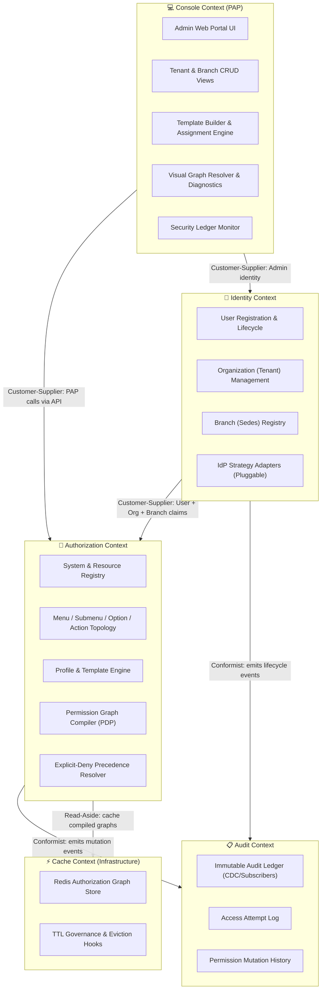

# 🗺️ Bounded Context Map — User Management System (UMS)

This document establishes the formal **Domain-Driven Design (DDD) Bounded Context Map** for the UMS platform. It defines the boundaries of each domain context, their internal responsibilities, and the integration contracts between them.

> [!IMPORTANT]
> This is a **Priority 1 Architectural Deliverable** as established in `architecture-spec.md`. All teams must align to this map before implementing features that cross context boundaries.

---

## 📐 1. Context Map Overview

---

## 📦 2. Context Definitions

### 🔐 A. Identity Context
**Mission:** Manage the lifecycle of all principals (users) and the organizational structures (tenants and branches) they belong to. Delegate credential verification to pluggable, external Identity Providers.

**Owns:**
- `User` aggregate (registration, suspension, offboarding)
- `Organization` (Tenant) aggregate
- `Branch` (Sedes) aggregate
- `IAuthenticationPort` (pluggable IdP strategy adapter)

**Does NOT own:**
- Authorization rules or permission logic
- Audit ledger storage

**Integration Contracts (Published Language):**
- `UserRegisteredEvent { userId, organizationId, branchId, employeeReference }`
- `UserSuspendedEvent { userId, tenantId }`
- `OrganizationCreatedEvent { tenantId, idpStrategy }`

---

### 🔑 B. Authorization Context
**Mission:** Act as the **Policy Decision Point (PDP)**. Compile and resolve the hierarchical authorization graph for any authenticated principal based on their organization, branch, profiles, and attached templates.

**Owns:**
- `System` aggregate (registered client applications)
- `Menu → Submenu → Option → Action` topology
- `Profile` aggregate
- `AuthorizationTemplate` aggregate
- `Authorization` (Allow/Deny records)
- `Permission Graph Compiler` (core engine)
- `Explicit-Deny Precedence` rules engine

**Does NOT own:**
- Identity verification (delegated to Identity Context via port)
- Cache storage (delegated to Cache Context via `ICachePort`)
- Admin UI rendering (delegated to Console Context)

**Integration Contracts (Published Language):**
- `GET /v1/authorization/graph` → returns `HierarchicalJsonGraph`
- `POST /v1/authorization/templates` → creates versioned template
- `PermissionMutatedEvent { userId, profileId, effect, actionId, timestamp }`

---

### 📋 C. Audit Context
**Mission:** Maintain an **immutable, tamper-proof ledger** of all identity events and permission mutations. Serves compliance, forensic, and SRE diagnostic needs.

**Owns:**
- `AuditRecord` entity (who, when, what, result)
- `AccessAttemptLog` (authentication success/failure)
- `PermissionMutationHistory` (ALLOW/DENY changes)

**Integration Pattern:** Event-driven subscriber (Conformist). Receives events from Identity and Authorization contexts via internal event bus (`IEventBusPort`). Does **not** call other contexts.

---

### 💻 D. Console Context (Policy Administration Point — PAP)
**Mission:** Provide the **Administrative Web Portal** that allows SuperAdmins and Tenant Managers to govern organizations, systems, profiles, templates, and diagnose permission graphs visually.

**Owns:**
- Admin Web Portal (React SPA)
- Template Builder UI
- Automated Assignment Rule Configurator
- Visual Graph Resolver

**Integration Pattern:** Customer-Supplier. Calls the Authorization Context and Identity Context via their published REST APIs. Does not access the database directly. Authenticates using the same UMS AuthGateway with a `SuperAdmin`-scoped `system_id`.

---

### ⚡ E. Cache Context (Infrastructure)
**Mission:** Provide a high-performance distributed cache layer for compiled authorization graphs, ensuring p95 < 5ms resolution on cache hits.

**Owns:**
- Redis key-value store (`auth_graph:{userId}:{systemId}:{tenantId}:{branchId}`)
- TTL policies (default: 3600s)
- Cache invalidation hooks (triggered on `PermissionMutatedEvent`)

**Integration Pattern:** Hidden behind a pure core `ICachePort` abstraction. Only the Authorization Context's infrastructure adapter interacts with Redis directly.

---

## 🔗 3. Context Relationships

| Upstream Context | Downstream Context | Pattern | Contract |
| :--- | :--- | :--- | :--- |
| Identity Context | Authorization Context | **Customer-Supplier** | User/Org/Branch claims pushed as events or queried via API |
| Authorization Context | Audit Context | **Conformist (Event)** | Publishes `PermissionMutatedEvent` consumed by Audit |
| Identity Context | Audit Context | **Conformist (Event)** | Publishes `UserRegisteredEvent`, `UserSuspendedEvent` |
| Console Context | Authorization Context | **Customer-Supplier** | PAP calls Authorization APIs for template/profile management |
| Console Context | Identity Context | **Customer-Supplier** | PAP calls Identity APIs for org/branch management |
| Authorization Context | Cache Context | **Shared Kernel (ICachePort)** | Read-aside pattern; invalidation on mutation events |

---

## 🚧 4. Anti-Corruption Layers (ACL)

To prevent tight coupling between contexts, the following ACL adapters are mandated:

| Boundary | ACL Mechanism | Reason |
| :--- | :--- | :--- |
| Authorization ↔ External IdP | `IAuthenticationPort` (Strategy Pattern) | Prevents Zitadel/Okta SDK from polluting core |
| Authorization ↔ Redis | `ICachePort` | Prevents Redis client from leaking into domain layer |
| Authorization ↔ Event Bus | `IEventBusPort` | Prevents Kafka/RabbitMQ from coupling to use cases |
| Console ↔ UMS APIs | REST API contracts (versioned) | Console is an external consumer; treated as any third party |
