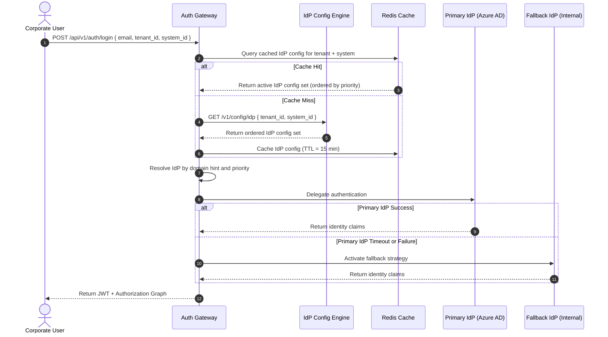
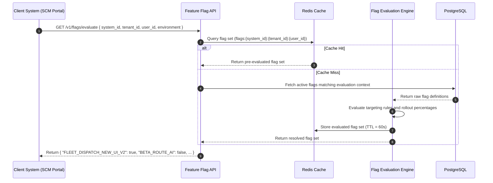

# 📐 UMS Configuration Platform — Functional & Architectural Specification

**Version:** 1.0.0 | **Status:** Accepted | **Method:** bMAD  
**Classification:** Core Platform Capability — Cross-Cutting Concern

> [!IMPORTANT]
> This specification introduces a **new cross-cutting bounded context** — the **Configuration & Feature Management Context** — that impacts the domain model, bounded context map, C4 diagrams, and existing ADRs. All teams must align to this document before implementing any configuration or feature flag capability.

---

## 🧭 1. Business Context & Strategic Rationale

Modern enterprise SaaS platforms require the ability to **adapt behavior at runtime without redeployment**. The UMS Configuration Platform provides a centralized, multi-tenant, auditable, and API-first parametrization engine that governs three orthogonal concerns:

1. **Identity Provider (IdP) Configuration** — *Who authenticates the user and how*
2. **System Behavioral Configuration** — *How each integrated application behaves at runtime*
3. **Feature Flag Management** — *Which features are active, for whom, and under what conditions*

These capabilities eliminate the need for environment-specific deployments when toggling behavior, adapting authentication strategies, or rolling out features progressively — enabling **Zero-Deployment Governance**.

---

## 📋 2. Pillar 1 — Multi-IdP Configuration Engine

### 2.1 Functional Requirements

The UMS must allow per-tenant (and optionally per-system) configuration of one or more Identity Providers (IdPs):

| Capability | Requirement |
| :--- | :--- |
| **Multiple IdPs per Tenant** | A tenant may register and activate more than one IdP simultaneously (e.g., Azure AD for employees + Google for contractors). |
| **IdP Type Registry** | Supported types: `INTERNAL_BCRYPT`, `ZITADEL`, `AZURE_AD`, `OKTA`, `KEYCLOAK`, `AUTH0`, `GOOGLE`, `LDAP`, `SAML2`, `GENERIC_OIDC`. |
| **Priority & Fallback Rules** | Each IdP entry has a `priority` rank. If the primary IdP is unreachable (timeout/500), the engine falls back in priority order. |
| **Hybrid Authentication** | A tenant may have INTERNAL + EXTERNAL IdPs active simultaneously. The routing strategy is evaluated per login attempt based on user domain hints. |
| **Per-System Association** | An IdP configuration can be scoped to a specific `system_id` (e.g., only the HCM Portal uses LDAP; SCM uses Azure AD). |
| **Secure Credential Storage** | OAuth client secrets, SAML certificates, and LDAP bind credentials are encrypted at rest using AES-256 and referenced by `config_secret_ref`. |

### 2.2 IdP Configuration Schema

```json
{
  "idp_config_id": "idp_azure_logisticscorp",
  "tenant_id": "tenant_logistics_corp",
  "system_id": "scm_route_planner",
  "provider_type": "AZURE_AD",
  "priority": 1,
  "fallback_to": "idp_internal_logisticscorp",
  "status": "ACTIVE",
  "config": {
    "authority_url": "https://login.microsoftonline.com/{tenant-id}/v2.0",
    "client_id": "app-client-id-xyz",
    "config_secret_ref": "vault://ums/secrets/logisticscorp/azure_client_secret",
    "scopes": ["openid", "profile", "email"],
    "user_claim_mapping": {
      "employee_reference": "employeeId",
      "email": "upn"
    }
  },
  "domain_hints": ["@logisticscorp.com"],
  "mfa_enforced": true,
  "created_at": "2026-05-09T00:00:00Z",
  "version": "1.0.0"
}
```

### 2.3 Sequence: IdP Resolution at Login



---

## 📋 3. Pillar 2 — System Behavioral Configuration Model

### 3.1 Functional Requirements

Each system registered in UMS must support a **dynamic, versioned, auditable configuration schema** that controls its runtime behavior:

| Parameter Category | Configurable Parameters |
| :--- | :--- |
| **Authentication** | `auth_strategy`, `mfa_enabled`, `mfa_method` (`TOTP`, `WEBAUTHN`, `SMS`), `passwordless_enabled` |
| **Session Policy** | `access_token_ttl_seconds`, `refresh_token_ttl_seconds`, `idle_session_timeout_seconds`, `max_concurrent_sessions` |
| **Multi-Tenancy Restrictions** | `allowed_organizations`, `blocked_regions`, `ip_allowlist`, `branch_restriction_enabled` |
| **Onboarding** | `self_registration_enabled`, `email_verification_required`, `auto_profile_creation_enabled` |
| **Branding & UI** | `primary_color`, `logo_url`, `login_background_url`, `tenant_display_name` |
| **Module Enablement** | `modules_enabled: ["fleet_dispatch", "route_planning", "audit_export"]` |

### 3.2 Configuration Schema

```json
{
  "system_config_id": "cfg_scm_logisticscorp_v2",
  "system_id": "scm_route_planner",
  "tenant_id": "tenant_logistics_corp",
  "version": "2.1.0",
  "status": "ACTIVE",
  "auth": {
    "mfa_enabled": true,
    "mfa_method": "WEBAUTHN",
    "passwordless_enabled": false,
    "session_timeout_seconds": 3600
  },
  "onboarding": {
    "self_registration_enabled": false,
    "auto_profile_creation_enabled": true,
    "default_profile_template": "Template_SCM_Analyst_Baseline_v1"
  },
  "branding": {
    "primary_color": "#0B3D91",
    "logo_url": "https://cdn.logisticscorp.com/logo.svg"
  },
  "modules_enabled": ["fleet_dispatch", "route_planning"],
  "published_at": "2026-05-09T00:00:00Z",
  "published_by": "usr_admin_superadmin_001"
}
```

### 3.3 Key Design Properties
- **Multi-tenant**: scoped by `tenant_id` + `system_id` composite key
- **Versioned**: each configuration change produces a new version; previous versions are archived (not deleted)
- **Auditable**: every write triggers a `SystemConfigUpdatedEvent` written to the Audit Context
- **API-first**: all configurations are read via `GET /v1/config/system/{system_id}?tenant_id=X`
- **Cache-backed**: configurations are cached in Redis at `sys_config:{system_id}:{tenant_id}` with a 5-minute TTL and evicted on `SystemConfigUpdatedEvent`

---

## 📋 4. Pillar 3 — Feature Flag Management Framework

### 4.1 Functional Requirements

The UMS must provide a **first-class, centralized Feature Flag engine** decoupled from core business logic:

| Capability | Requirement |
| :--- | :--- |
| **Scoped Targeting** | Flags can be scoped to: `tenant`, `organization`, `branch`, `role`, `user`, `environment`, `system` |
| **Flag Types** | `BOOLEAN` (on/off), `VARIANT` (A/B/multivariate), `PERCENTAGE` (gradual rollout 0–100%) |
| **Evaluation Targets** | Menus, Modules, API Endpoints, Internal Workflows, UI Components, Technical Toggles |
| **Real-Time Evaluation** | Flags evaluated in real-time via API without requiring application redeployment |
| **Unique Flag Codes** | Each flag has a globally unique `flag_code` string consumed by client systems |
| **Gradual Rollout** | Percentage-based rollout supports Canary releases and Beta feature strategies |
| **Audit Trail** | Every flag state change is logged immutably with actor, timestamp, and previous state |
| **Distributed Cache** | Evaluated flag sets are cached per evaluation context (`flags:{system_id}:{tenant_id}:{user_id}`) |

### 4.2 Flag Definition Schema

```json
{
  "flag_id": "flag_fleet_dispatch_new_ui",
  "flag_code": "FLEET_DISPATCH_NEW_UI_V2",
  "type": "PERCENTAGE",
  "description": "Enables the redesigned Fleet Dispatch UI for progressive rollout.",
  "targets": {
    "systems": ["scm_route_planner"],
    "tenants": ["tenant_logistics_corp"],
    "environments": ["staging", "production"],
    "rollout_percentage": 25
  },
  "status": "ACTIVE",
  "linked_to": {
    "type": "menu",
    "resource_id": "menu_fleet_dispatch"
  },
  "created_by": "usr_admin_superadmin_001",
  "created_at": "2026-05-09T00:00:00Z",
  "version": "1.0.0"
}
```

### 4.3 Feature Flag Evaluation Flow



### 4.4 Rollout Strategy Support

| Strategy | Implementation |
| :--- | :--- |
| **Canary Release** | `type: PERCENTAGE`, start at 5% of tenant users, increment gradually |
| **Beta Features** | `type: BOOLEAN` scoped to a specific `user_id` list (beta testers) |
| **Environment Gating** | Flag only `ACTIVE` in `staging`, disabled in `production` until approved |
| **Tenant A/B Test** | `type: VARIANT` with two variants assigned to two tenant groups |

---

## 📊 5. Impact Analysis

### 5.1 Domain Model Impact — New Entities Required

| New Entity | Purpose | Key Attributes |
| :--- | :--- | :--- |
| `IDP_CONFIGURATION` | Stores per-tenant/system IdP provider settings | `id`, `tenant_id`, `system_id`, `provider_type`, `priority`, `fallback_to`, `config_encrypted`, `status`, `version` |
| `SYSTEM_CONFIGURATION` | Stores versioned behavioral configuration per system/tenant | `id`, `system_id`, `tenant_id`, `version`, `config_payload (jsonb)`, `status`, `published_at`, `published_by` |
| `FEATURE_FLAG` | Defines a feature flag with targeting rules | `id`, `flag_code (unique)`, `type`, `targets (jsonb)`, `status`, `linked_resource_type`, `linked_resource_id`, `version` |
| `FLAG_EVALUATION_LOG` | Immutable log of flag evaluations for audit | `id`, `flag_id`, `evaluated_for (user/tenant)`, `result`, `evaluated_at` |
| `CONFIG_ASSIGNMENT_RULE` | Maps system configuration to target scopes | `id`, `config_id`, `scope_type`, `scope_id`, `priority` |

### 5.2 Bounded Context Impact

> [!IMPORTANT]
> A **new bounded context** must be introduced: `Configuration & Feature Management Context`. This context cannot be absorbed into any existing context without violating Single Responsibility and creating high coupling.

**New context owns:**
- `IDP_CONFIGURATION` aggregate
- `SYSTEM_CONFIGURATION` aggregate
- `FEATURE_FLAG` aggregate
- Feature Flag Evaluation Engine
- IdP Configuration Resolver
- Configuration Cache Manager

**Upstream dependencies of new context:**
- Identity Context → supplies `tenant_id`, `organization_id` as scoping keys
- Authorization Context → consumes `system_id` for config lookup

**Downstream consumers of new context:**
- Auth Gateway → reads IdP config to route authentication
- Client Systems (SCM, TMS) → read system config and feature flags at startup/request time
- Console Context → administers all configurations via UI

### 5.3 C4 Diagram Impact

**Level 1 (System Context):**
- Add: `Configuration API` as a new external-facing capability of UMS

**Level 2 (Container):**
- Add: `Config & Feature Flag Service (NestJS Module)` container
- Add: `Configuration Cache (Redis namespace: cfg:*)` — distinct key namespace from auth graphs

### 5.4 ADR Impact

| ADR | Impact | Action Required |
| :--- | :--- | :--- |
| ADR-0010 (Multi-Tenancy) | Config entities must respect RLS tenant isolation | No change required — RLS automatically applies |
| ADR-0014 (Redis Caching) | New cache namespaces `cfg:*` and `flags:*` must be added | **Extend ADR-0014** or create ADR-0025 |
| ADR-0016 (Immutable Audit) | Config mutations and flag changes must trigger audit subscribers | No change — pattern applies automatically |
| ADR-0017 (Feature Flagging) | ADR-0017 already partially covers this — **must be fully aligned and expanded** | **Update ADR-0017 to reference this spec** |
| ADR-0020 (IdP Abstraction) | Multi-IdP config with priority/fallback extends ADR-0020's scope significantly | **Extend ADR-0020** with multi-IdP model |

### 5.5 API Contract Impact — New Endpoints Required

| Endpoint | Method | Description |
| :--- | :--- | :--- |
| `/v1/config/idp` | `GET` | Returns ordered IdP config for a `tenant_id` + `system_id` |
| `/v1/config/idp` | `POST` | Register a new IdP configuration |
| `/v1/config/idp/{id}` | `PUT` | Update an IdP configuration |
| `/v1/config/system/{system_id}` | `GET` | Returns active system config for a tenant |
| `/v1/config/system` | `POST` | Publish a new system configuration version |
| `/v1/flags` | `GET` | List all active feature flags for an admin context |
| `/v1/flags` | `POST` | Create a new feature flag |
| `/v1/flags/{flag_code}` | `PATCH` | Update flag status or targeting rules |
| `/v1/flags/evaluate` | `POST` | Evaluate active flags for a given runtime context |

### 5.6 Integration Events Impact — New Domain Events

| Event | Published By | Consumed By | Purpose |
| :--- | :--- | :--- | :--- |
| `IdpConfigCreatedEvent` | Config Context | Audit Context | Track IdP registrations |
| `IdpConfigUpdatedEvent` | Config Context | Audit Context + Cache Eviction | Invalidate cached IdP config |
| `SystemConfigPublishedEvent` | Config Context | Audit Context + Cache Eviction + Client Systems | Broadcast config changes |
| `FeatureFlagCreatedEvent` | Config Context | Audit Context | Track flag lifecycle |
| `FeatureFlagStateChangedEvent` | Config Context | Audit Context + Cache Eviction + Client Systems | Broadcast flag state changes |

---

## 🚧 6. Constraints & Non-Functional Requirements

| Attribute | Requirement |
| :--- | :--- |
| **Performance** | Flag evaluation must complete in p95 < 3ms (cache hit), p95 < 50ms (cache miss) |
| **Cache TTL** | IdP config: 15 min | System config: 5 min | Flag sets: 60s |
| **Security** | IdP credentials encrypted with AES-256 at rest; never returned in plaintext via API |
| **Versioning** | All config entities support semantic versioning; mutations archive prior versions |
| **Audit** | 100% of config mutations written to immutable audit ledger |
| **Availability** | Config API must tolerate UMS DB unavailability via last-known-good cache fallback |
| **Isolation** | All config entities are RLS-enforced by `tenant_id` |
