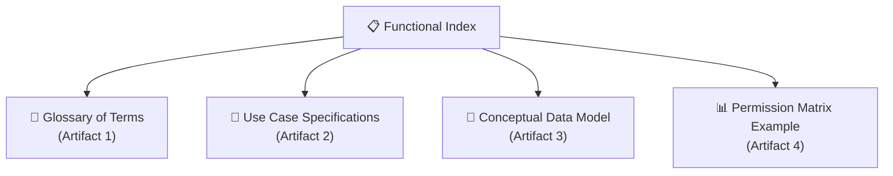

# 📋 ULPMS Functional Documentation Index

This directory contains the formal, divided technical-functional specifications for the **User Life-Cycle & Permissions Management System (ULPMS)** under the **bMAD Method**.

---

## 🗺️ Functional Core Map

The functional design of ULPMS is divided into four main architectural artifacts:

---

## 📂 Architectural & Functional Artifacts

Select an artifact to review its complete enterprise functional specification:

1.  **[Artifact 1: Glossary of Terms](./glossary_of_terms.md)**: Standardized business terms and technical definitions for ULPMS entities.
2.  **[Artifact 2: Use Case Specifications](./use_case_specifications.md)**: Detailed transaction flows, pre-conditions, and alternative paths for core operations.
3.  **[Artifact 3: Conceptual Data Model](./conceptual_data_model.md)**: Database schemas, attributes, relationships, and Entity-Relationship diagrams.
4.  **[Artifact 4: Permission Matrix Example](./permission_matrix_example.md)**: Practical demonstrations of multi-profile permission resolution under the *Explicit-Deny Precedence* rules.

---

## 🖼️ Conceptual Diagram
*   Review the original high-resolution **[Conceptual UML Diagram](./UMS.conceptual.jpg)** which serves as the visual reference for this technical-functional design.
